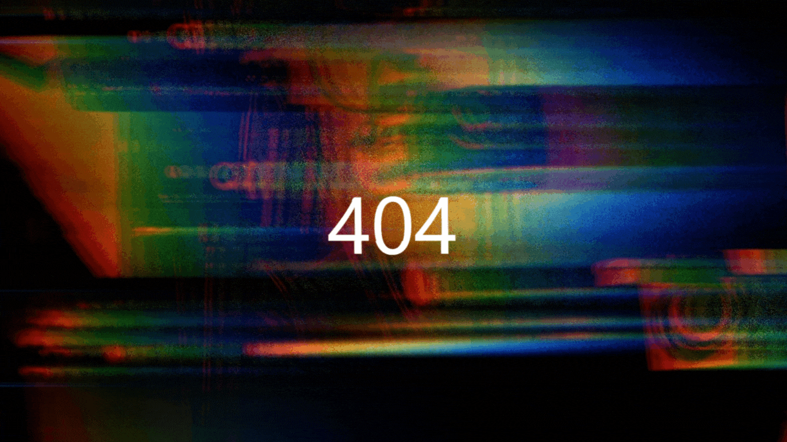

<h1>Daily UI Day 03: Splash Page</h1>

This is a 404 Error page for Daily UI's Day 03 challenge for the <a href="https://www.dailyui.co/"> 100 Days of UI 
challenge.</a>

- [Repo](https://github.com/kelseychristensen/Daily-UI-Day-008 "Daily UI Day 08 Repo")

## My process

### Built with

- HTML
- CSS

### What went into this project

A lot of messing around with the animation in CSS, and not much else. 

### What I learned

See above. 

### Continued development

Writing CSS animations!

## Author

Kelsey Christensen

- [Profile](https://github.com/kelseychristensen "Kelsey Christensen")
- [Email](mailto:kelsey.c.christensen@gmail.com?subject=Hi "Hi!")
- [Dribble](https://dribbble.com/kelseychristensen "Hi!")
- [Website](http://kelseychristensen.com/ "Welcome")

## Acknowledgements 

Would not have been possible without Piotr Galor's [CSS.](https://codepen.io/pgalor/pen/OeRWJQ)